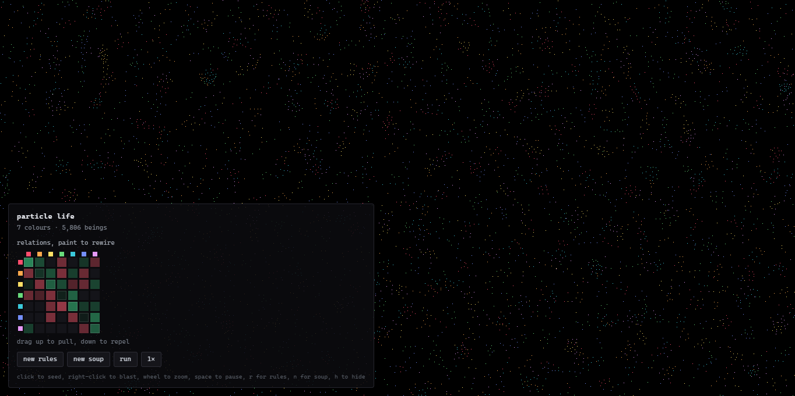
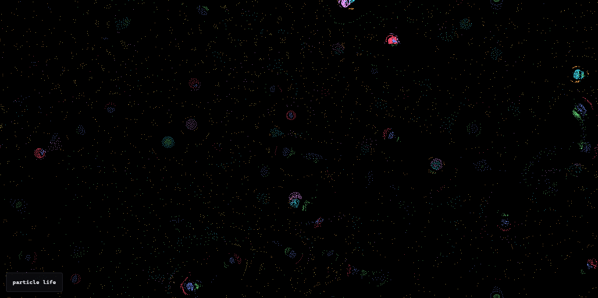
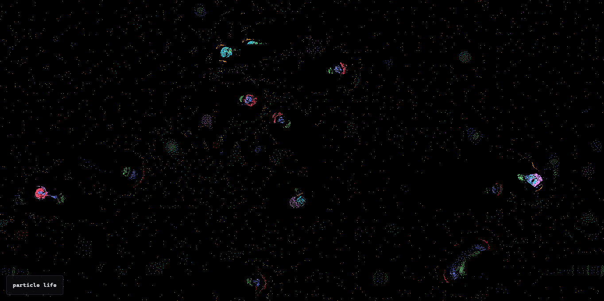

# particle life


The seven colours of pixels push and pull on each other by a set of rules, and out of that mess they build shapes nobody drew, cells, filaments, worms, little chasing swarms. every particle is a single coloured pixel. you can rewrite the rules while it runs, zoom into the crowd, and poke it around with the mouse.





**live demo:** [Particle Life](https://lakshyabuilds.github.io/particle-life/)

## what it actually does

- ~1,200 to 9,000 particles to start, seven colours, each one exactly one pixel.
- The little grid in the corner is the rule table. a row pulls or pushes a column. green cells attract, red cells repel. You can drag up or down on any cell to change it live and watch the whole field react.
- The world wraps at the edges (it's a torus), so nothing piles into a corner and dies there.
- The `new rules` rolls a fresh random rule set. before it shows you one, it quietly test-runs it in miniature and throws out the boring outcomes like becoming dead or too stable that they can't move.
- You can click to drop new particles of random colours, hold left to gather a crowd, hold right to blast it apart. Also, you can grow it up to 20,000.

## why i made it

I have seen many particle-life videos on YouTube. And, the most of the concept of those videos are just about how basic rules can create emergent complexity and actually behave like a real cell on their own. To actually understand how chaos can get in order, I built this and in this there is no hardcoded behavior, just simple rules and physics.

## tech stack

- Plain javascript, no framework, no build step
- HTML canvas 2d for drawing
- Typed arrays (`Float32Array`) for the particle data, plus a spatial hash grid so it can check neighbours without comparing every pair
- Zero dependencies. Three files, `index.html`, `style.css`, `script.js`

## how it was built (and what broke)

The physics is the standard particle-life force like a short-range pushes so particles never sit on top of each other, then an attraction or repulsion in the mid range set by the rule table. The shape of that force is flat at both ends and peaks in the middle.

Three things that went wrong when I was building this were-

1. **Everything froze in about a second.** The friction was eating all the momentum every frame. bumping it up so more velocity survives each step is what let the swarms keep orbiting instead of locking solid.
2. **Particles crawled into the corners and got stuck.** I switched the world to a torus, so leaving the right edge means coming back on the left, and the force calculation measures the short way across the seam instead of the long way across the map.
3. **It kept collapsing into dead lumps.** The fix was making every colour repel itself (negative diagonal) and arranging the colours into a chase ring where each one hunts the next and flees the last. now it never fully settles.

## how to run it

There's no install and nothing to build. three files, no dependencies.

**Quickest Way-** Just download `index.html` and double-click it. it opens in your browser and runs.

**if double-clicking don't works** (some browsers can't opem local files), serve the folder with python, which comes with most machines:

1. clone or download the repo

    ```sh
    git clone https://github.com/lakshyabuilds/particle-life.git && cd particle-life
    ```

2. start a small local server

    ```sh
    python3 -m http.server 8000
    ```

3. open it in your browser

    ```sh
    http://localhost:8000
    ```

VS Code users can also right-click `index.html` and pick "open with live server" if you have that extension.

## controls

- **click**: drop a handful of random-colour particles
- **hold left**: gather the nearby crowd
- **hold right**: blast them apart
- **wheel / pinch**: zoom
- **double-click**: reset the zoom
- **space**: pause
- **r**: new rules
- **n**: reset the soup
- **h**: hide the panel
- **drag on the corner grid**: rewrite the rules live

## ai disclosure

No, I didn't use any AI for any step. Because I got this idea from my personal feed of YouTube. For the development, I have borrowed several ideas from multiple sources, and have developed whole project by my own. There are many several break & make moments of my project and my commit history & Hackatime validates this perfectly.
